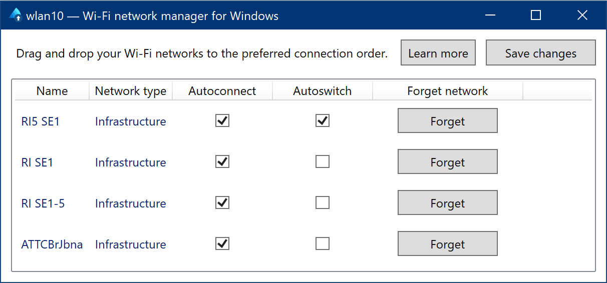

# wlan10 — Wi-Fi network manager for Windows

wlan10 is a Wi-Fi network manager for Windows. It allows users to set the preferred connection order of Wi-Fi networks, so their computer will always connect to the best Wi-Fi when multiple networks are available.

This functionality was available in older versions of Windows, but was removed in Windows 10. wlan10 fills this gap, without the need for users to hack around with the command-line `netsh` commands.

## Requirements

* Windows 10 or 8.1
* .NET 4 or newer
* A PC with Wi-Fi support

## Usage

1. Download wlan10 from [releases](https://github.com/afit/wlan10/releases) and run it.
2. wlan10 will show a list of networks that your computer is configured to automatically connect to.

    wlan10 can't add Wi-Fi networks to your list: you should add new networks by connecting to them through Windows as usual.

3. Drag and drop networks to change the preferred connection order to your liking, and click `Save changes` to store this new order. Windows will now prefer the networks which you put on top, selecting the highest positioned available network.
    
wlan10 is only required for configuring preferred network connect order: it does not need to remain running in the background, and can even be deleted after use.

### What do autoconnect and autoswitch mean?

Networks with `autoconnect` set will be automatically connected to if your computer isn't currently connected to a Wi-Fi network. The highest ordered (from the top) network will be connected to.

If a higher-ordered network becomes available after your computer is connected to a Wi-Fi network, it will switch to it if `autoswitch` is checked. Checking `autoswitch` will result in higher frequency of periodic scanning for new networks. This may result in increased radio frequency pollution from these periodic scans and increased power consumption used by the wireless network adapter.

## Support

Raise an [issue here](https://github.com/afit/wlan10/issues) if you have suggestions or problems.

## Credits & license

[Bertware](http://www.bertware.net) created wlan10 and ran it up until version 1.1.2. It is currently maintained by [Aidan Fitzpatrick](https://github.com/afit/).

This project is subject to the Mozilla Public License Version 2.0. A copy of the license is included in this repository.

The [`GongSolutions.WPF.DragDrop`](https://github.com/punker76/gong-wpf-dragdrop) library is used by this project, and is subject to the BSD 3-Clause License.

    Copyright © 2015, Jan Karger (Steven Kirk). All rights reserved.

    Redistribution and use in source and binary forms, with or without modification, are permitted provided that the following conditions are met:

    Redistributions of source code must retain the above copyright notice, this list of conditions and the following disclaimer.

    Redistributions in binary form must reproduce the above copyright notice, this list of conditions and the following disclaimer in the documentation  and/or other materials provided with the distribution.

    Neither the name of gong-wpf-dragdrop nor the names of its contributors may be used to endorse or promote products derived from this software without specific prior written permission.

    THIS SOFTWARE IS PROVIDED BY THE COPYRIGHT HOLDERS AND CONTRIBUTORS "AS IS" AND ANY EXPRESS OR IMPLIED WARRANTIES, INCLUDING, BUT NOT LIMITED TO, THE IMPLIED WARRANTIES OF MERCHANTABILITY AND FITNESS FOR A PARTICULAR PURPOSE ARE DISCLAIMED. IN NO EVENT SHALL THE COPYRIGHT HOLDER OR CONTRIBUTORS BE LIABLE FOR ANY DIRECT, INDIRECT, INCIDENTAL, SPECIAL, EXEMPLARY, OR CONSEQUENTIAL DAMAGES (INCLUDING, BUT NOT LIMITED TO, PROCUREMENT OF SUBSTITUTE GOODS OR SERVICES; LOSS OF USE, DATA, OR PROFITS; OR BUSINESS INTERRUPTION) HOWEVER CAUSED AND ON ANY THEORY OF LIABILITY, WHETHER IN CONTRACT, STRICT LIABILITY, OR TORT (INCLUDING NEGLIGENCE OR OTHERWISE) ARISING IN ANY WAY OUT OF THE USE OF THIS SOFTWARE, EVEN IF ADVISED OF THE POSSIBILITY OF SUCH DAMAGE.
